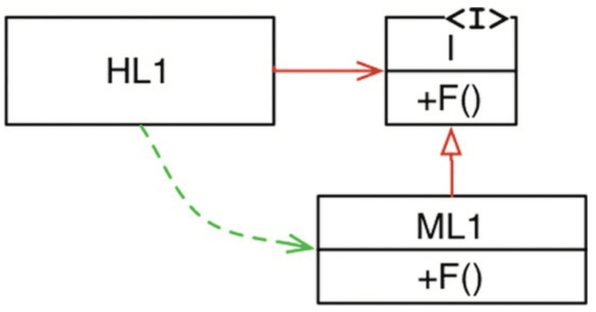

# 5장 객체지향 프로그래밍 (OO 설계 원칙)

객체지향의 본질
- 캡슐화
- 상속
- 다형성

### 캡슐화?
- OO 언어는 데이터와 함수를 쉽고 효과적으로 캡슐화하는 방법을 제공
- 이를 통해서 데이터와 함수가 응집력있게 구성된 집단을 서로 구분 짓는 선을 그을 수 있도록 함
- 구분선 바깥(ex_ 접근제어자)에서는 데이터는 은닉되고, 일부 함수만 외부로 노출된다.
    - `private, public ...`

> OO 프로그래밍은 프로그래머가 충분히 올바르게 행동함으로써 캡슐화된 데이터를 우회하여 사용하지 않을 것이라는 믿음을 기반으로 한다.
> 실제로 많은 OO 언어가 캡슐화를 강제하지는 않는다.

### 상속?
OO 언어는 더 나은 캡슐화를 제공하지는 못함.
하지만 상속만큼은 객체지향언어가 확실히 제공했다.
- OO 언어 이전에도 상속과 비슷한 기법이 사용되긴 했으나, 굉장히 불편
- 상속으로서 새로운 개념을 만들지는 못했지만, 데이터 구조적 면에서는 굉장히 편리한 방식을 통해 상속을 지원

### 다형성?
- 객체지향 이전에도 다형성을 표현할 수 있는 언어는 존재
- 함수를 가리키는 `포인터`를 응용한 것이 다형성
- 객체지향언어는 다형성을 좀 더 안전하고 편리하게 사용할 수 있도록 해줌
- 객체지향 언어는 제어흐름을 간접적으로 전환하는 규칙을 부과한다고 결론 지을 수 있다.

### 다형성이 가진 힘
- Plugin Architecture : 독립성을 지원하기 위해 만들어지고 적용됌
- 객체지향의 등장으로 언제 어디서든 플러그인 아키텍처를 적용할 수 있게 된다.

### DI (의존성 역전)
다형성을 안전하고 편리하게 적용할 수 있는 메커니즘 등장 전, 호출 트리에서는 의존성 방향은 반드시 제어흐름(flow of control)을 따랐다.

하지만 다형성을 통해 의존성과 제어흐름이 반대로 이루어질 수 있게 되었다.

`HL1`은 `ML1` 모듈의 `F()`를 호출한다. 하지만 소스코드에서는 `HL1`모듈은 인터페이스를 통해 `F()`를 호출함
`ML1`과 `I` 인터페이스 사이에 소스 코드 의존성(상속관계)이 제어흐름과는 반대로 흘러가는데, 이를 의존성 역전이라고 한다.
- 이를 통해 객체지향 언어로 개발된 시스템을 다루는 SW 아키텍트는 소스 코드 의존성 전부에 대해 방향을 결정할 수 있는 절대적인 권한을 갖게되는 것이다.
- 이것이 객체지향이 제공하는 힘
- 이를 통해 비즈니스 규칙이 DB / UI 에 의존하지만, 소스코드 면에서는 의존성을 뒤집을 수 있어,
  UI와 DB와는 독립적으로 배포할 수 있다(배포독립성 - independent deployability)
- 개발 독립성 또한 갖게된다. (각 시스템 모듈이 독립적 배포가 가능하기 때문에 서로 다른 팀에서 각 모듈을 독립적으로 개발할 수 있음)

### 결론
- 객체지향 : 다형성을 이용하여 전체 시스템의 모든 소스 코드 의존성에 대해 절대적인 제어 권한을 획득할 수 있음
- 객체지향 사용 -> 플러그인 아키텍쳐 구성 가능
- 고수준 모듈이 저수준 모듈에 대해 독립성을 보장할 수 있음 