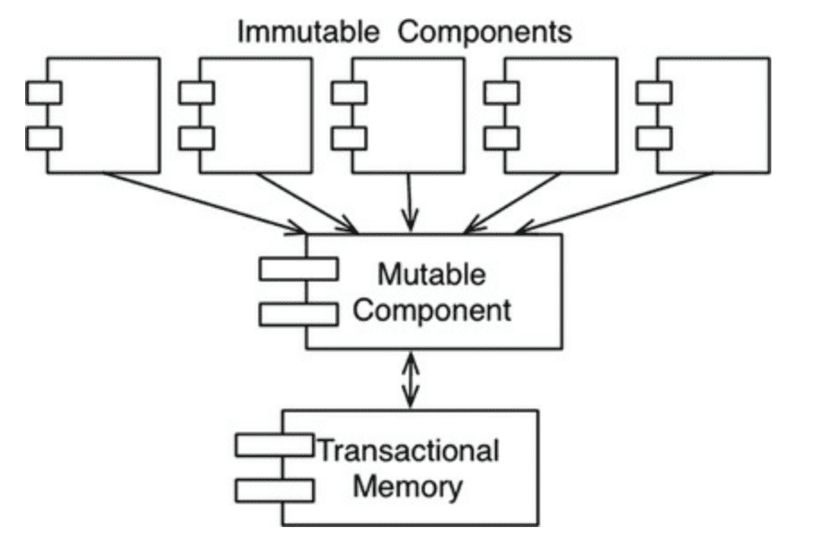

# 6장 함수형 프로그래밍(FP)

FP 패러다임의 람다(`lambda`)계산법으로 1930년 발명

### 정수를 제곱하기
- 리스프에서 파생한 클로저(Clojure)는 함수형 언어
- Java는 가변 변수(Mutable Variable) 사용 - 가변 변수는 프로그램 실행중에 상태가 변할 수 있다.
- 클로저는 이러한 가변 변수 존재 X

> 함수형 언어에서는 변수는 한 번 초기화되면 절대로 변하지 않는다.

### 불변성(Immutable)과 아키텍처
가변 변수에 의해 아키텍처에서 발생하는 문제
- Race Condition
- DeadLock
- 동시 업데이트(Concurrent Update)

아키텍트는 동시성(Concurrency) 문제에 대해 고려할 줄 알아야한다.

### 가변성의 분리
불변성과 관련하여 **가변 컴포넌트와 불변 컴포넌트를 분리**하는 것이 중요하다.
- 불변 컴포넌트 : 순수 함수 방식으로 작업 처리할 수 있도록 하며, 어떠한 가변 변수도 사용하지 않음
    - 변수의 상태를 변경할 수 있는, 즉 순수 함수형 컴포넌트가 아닌 하나 이상의 다른 컴포넌트와 통신하도록 한다 .
- 가능한 많은 처리를 불변 컴포넌트에서 진행하고, 가변 컴포넌트의 코드를 줄여야 함

### 이벤트 소싱
저장 공간과 처리 능력의 한계는 점점 없어지는 중 -> 가변 상태는 적어질 수 있는 환경

이벤트 소싱[Event Sourcing] : 상태가 아닌 트랜잭션을 저장하는 전략
- 상태가 필요해지면 단순히 상태의 시작점부터 모든 트랙재션으로 분류하여 처리
- 저장 공간과 처리 능력이 충분하다면 어플리케이션이 완전한 불변성을 갖추도록 만들 수 있으며, 이는 곧 **완전한 함수형**
> ex) 소스 코드 버전 관리 시스템 (git)

### 결론
- 구조적 프로그래밍 :  제어흐름의 직접적인 전환에 부과되는 규율이다.
- 객체 지향 프로그래밍 : 제어흐름의 간접적인 전환에 부과되는 규율이다.
- 함수형 프로그래밍 : 변수 할당에 부과되는 규율이다.

> 소프트웨어, 즉 컴퓨터 프로그램은 순차(sequence), 분기(selection), 반복(iteration), 참조(indirection)로 구성된다. 그 이상도 이하도 아니다.

