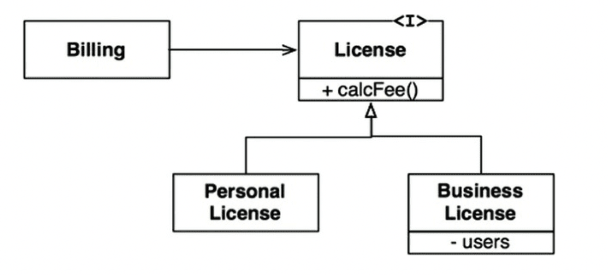

# 9장 LSP : 리스코프치환 원칙
하위 타입(subType)에 대한 정의 :
- S 타입의 객체 o1에 대응하는 T타입 객체 o2가 있다. -> o1: S, o2: T
- T 타입을 이용해서 정의한 모든 프로그램 P에서 o2의 자리에 o1을 치환해도 P의 행위가 변하지 않는다면, S는 T의 하위 타입이다.

### 상속을 사용하도록 가이드

- 위 사례는 LSP를 만족한다.
    - `Billing` 의 행위는 `License` 하위 타입 중 무엇을 사용하는 지 의존적이지 않음
    - 하위 타입 모두 License 타입으로 치환 가능
### Square/Rectangle 문제

- 정사각형은 직사각형의 하위 타입으로는 적합하지 않음
    - 직사각형의 높이와 너비는 서로 독립적으로 변경될 수 있지만, 정사각형의 높이와 너비는 반드시 같이 변경
    - 이를 해결하기 위해 조건문을 사용해야 정사각형인지 확인가능하며,
    - 이러면 User의 행위는 사용하는 타입에 의존적이므로 결국 타입을 서로 치환할 수 없으므로 LSP를 만족하지 못함

### LSP와 아키텍처
- LSP는 인터페이스와 구현체에도 적용된다
- 아키텍처 관점에서 LSP를 이해하는 최선의 방법은 이 원칙을 어겼을 때, 시스템 아키텍처에서 무슨 일이 일어나는 지 관찰하는 것

### LSP 위배 사례
- LSP를 위배했을 때 아키텍트는 REST 서비스들의 인터페이스가 서로 치환 가능하지 않다는 사실을 처리하는 중요하고 복잡한 메커니즘을 추가해야하는 상황도 생긴다.

### 결론
- LSP는 아키텍처 수준까지 확장할 수 있고, 반드시 확장해야한다
- 치환 가능성을 조금이라도 위배하면 시스템 아키텍처가 오염되어 상당량의 별도 메커니즘을 추가해야할 수 있다. 
