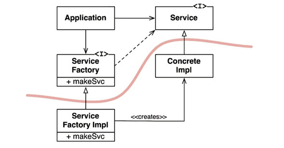

# 11장 DIP : 의존성 역전 원칙

### 유연성이 극대화된 시스템
- 소스 코드 의존성이 추상(abstraction)에 의존하며, 구체(concretion)에는 의존하지 않는 시스템
- 의존하지 않도록 피하고자 하는 요소 : 변동성이 큰(volatile) + 구체적(concretion)요소
    - 구체적인 요소 : 개발에서 자주 변경될 수 밖에 없는 모듈

### 안정된 추상화
- 추상 인터페이스에 변경이 생김녀 이를 구체화한 구현체들도 따라서 수정해야 함
- 반대로 구체적인 구현체에 변경이 생기더라도, 그 구현체가 구현하는 인터페이스는 대다수의 경우 변경될 필요 X
- **즉, 인터페이스는 구현체보다 변동성이 낮음**

> DIP를 실천하는 법
> 1. 변동성이 큰 구체 클래스를 참조하지 말라
     >   - 대신 추상 인터페이스를 참조할 것
>   - 추상 팩토리(abstract factory)를 사용하도록 강제
> 2. 변동성이 큰 구체 클래스로부터 파생하지 말 것
     >   - 정적 타입 언어에서의 상속은 소스 코드에 존재하는 모든 관계중 변경하기 어려움
>   - 따라서 상속은 아주 신중하게 사용해야 한다 .
> 3. 구체 함수를 오버라이드 하지 말 것
     >   - 대체로 구체 함수는 소스 코드 의존성을 필요로 한다.
>   - 오버라이드하면 의존성을 상속하게 된다.
>   - 의존성을 제거하기 위해서, 추상 함수로 선언하고 구현체들에서 각자의 용도에 맞게 구현 할 것
> 4. 구체적이며 변동성이 크다면 절대로 그 이름을 언급하지 말 것

### 팩토리

- 의존성 관리를 위해 추상 팩토리(Abstract Factory) 패턴 사용

- `Application`은 `Service` 인터페이스를 통해 `ConcreteImpl` 사용하지만, `Application`에서는 어떤 식으로든 `ConcreteImpl` 인스턴스를 생성해야함
- `ConcreteImpl`에 대해 소스 코드 의존성을 만들지 않으면서 이 목적을 이루기 위해 `Application`은 `ServiceFactory` 인퍼테이스의 `makeSvc()`를 호출
- 이 메서드는 `ServiceFactory`로 부터 파생된 `ServiceFactoryImpl`에서 구현된다.
- 그리고 `ServiceFactoryImpl` 구현체가 `ConcreteImpl`의 인스턴스를 생성한 후 `Service`타입으로 반환한다.

해당 곡선은 아키텍처의 경계를 뜻한다.
- 이 곡선은 구체 / 추상 을 분리
- 소스 코드 의존성은 해당 곡선과 교차할 때 모두 한 방향, 즉 추상적인 쪽으로 향한다.
- 곡선은 시스템을 추상 컴포넌트/구체 컴포넌트로 분리
    - 추상 컴포넌트 : application에서 모든 고수준 업무 규칙을 포함한다.
    - 구체 컴포넌트 : 업무 규칙을 다루기 위해 필요한 모든 세부사항을 포함한다
    - 즉 소스 코드 의존성은 제어흐름과 반대 방향으로 역전된다. -> DI

### 구체 컴포넌트
구체 컴포넌트에 구체적인 의존성은 없어야 하지만, DIP를 모두 없앨 수 없다. (일반적으로)
- 이를 구체 컴포넌트를 최소한 하나는 포함할 것인데, 이를 메인(main)이라 칭함

### 결론
DIP는 아키텍처 다이어그램에서 가장 눈에 드러나는 원칙
- 의존성은 아키텍처 경계를 기준으로, 더 추상적인 엔티티가 있는 쪽으로 향한다.
- 이 