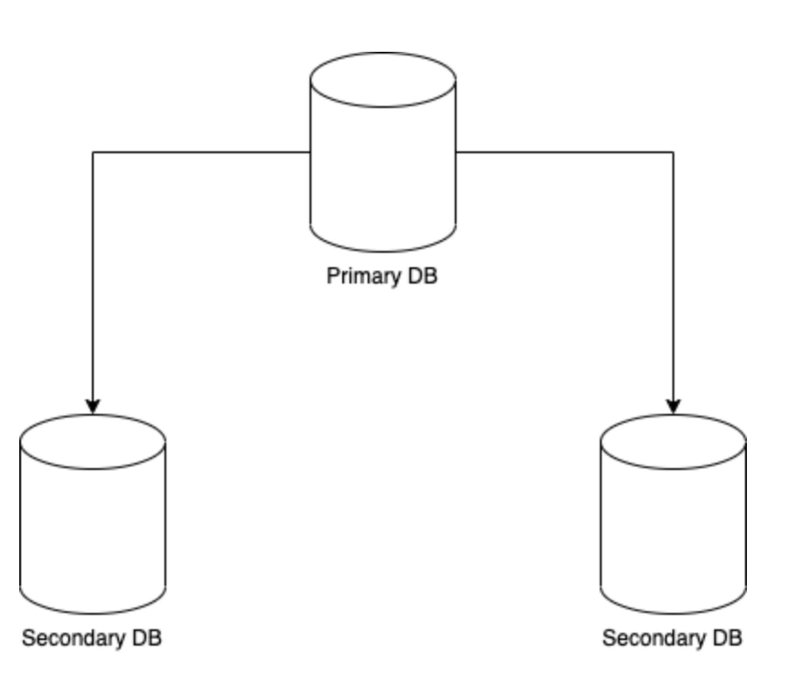
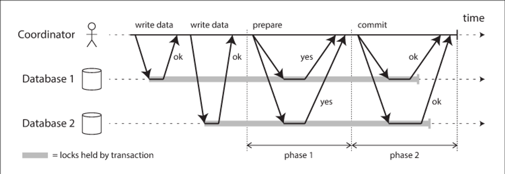
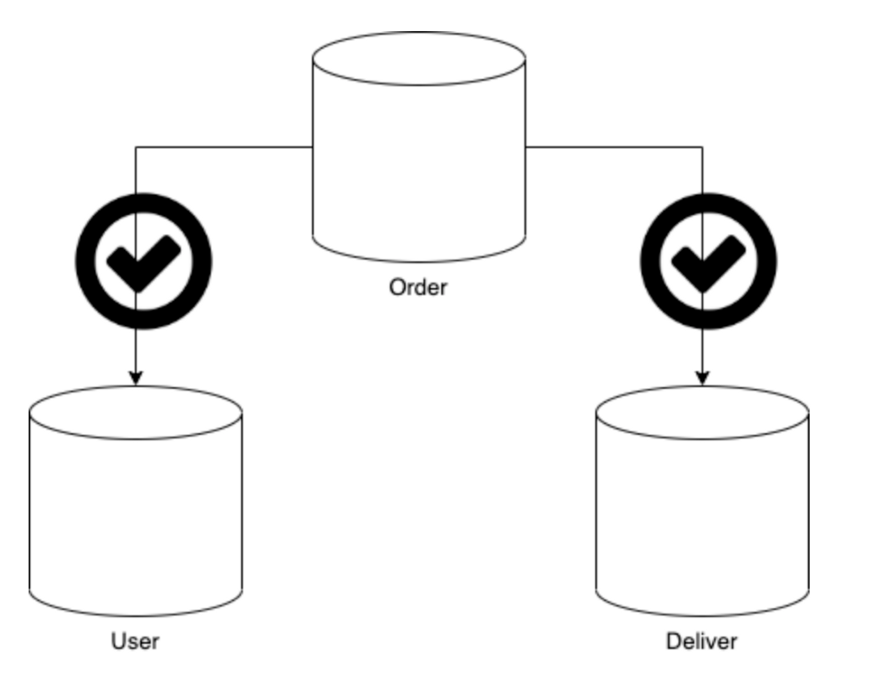
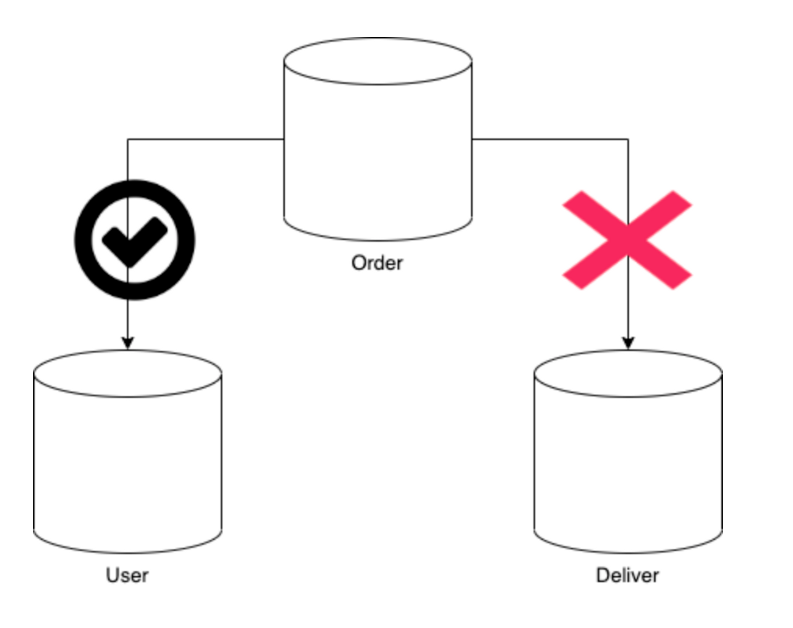
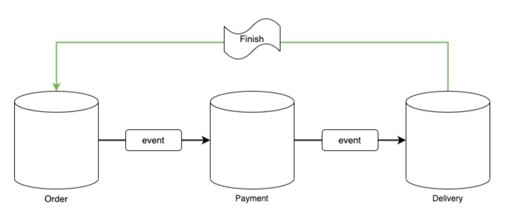
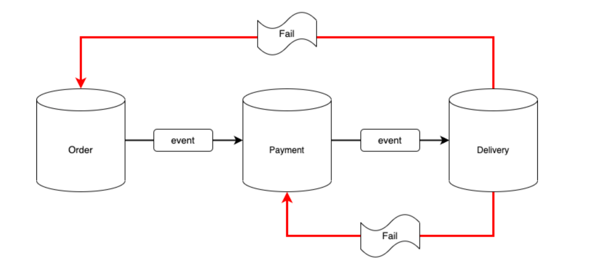
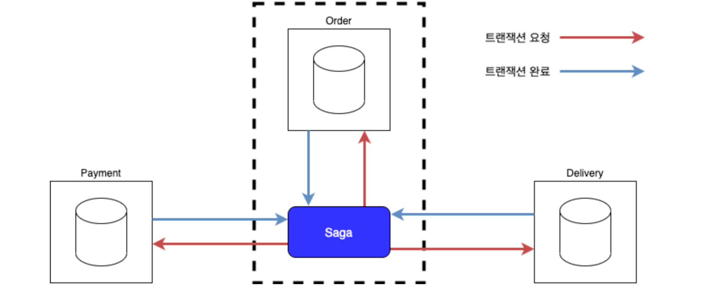

## 2PC 와 SAGA 패턴

- MSA에서는 각 서비스별로 DB 인스턴스와 애플리케이션이 분리됨
    - 관계형으로 맺어진 Entity들은 서로가 다른 인스턴스로 운영되고,
      그들의 리소스를 받기 때문에 데이터 일관성 깨짐

  → 이를 위해 개발자들은 MSA에서 분산 트랜잭션 기술을 이용 → 일관성을 지킬 수 있도록

### 2PC [Two-Phase Commit]

2단계에 거쳐서 영속하는 작업 (JPA에 있는 영속성 컨텍스트와는 다름)

- 분산 DB 환경 : 주 DB / 보조 DB
- 실제 모놀리틱에서 연결된 메인 DB = Primary DB
    - 이중화된 DB 형태를 가지려면 DB들은 동기화 형태로 되어야 함
- 2PC : 주 DB - 보조 DB 사이에 트랜잭션을 조율하는 Coordinator가 존재
    - 역할 트랜잭션 요청이 들어왔을 때, **Prepare**, **Commit** 단계를 거쳐 트랜잭션 담당

  

**Prepare : 분산환경과 모놀리틱의 차이점**

- 모놀리틱 : 어차피 본인들의 인스턴스를 공유 → 트랜잭션 적용하려는 DB가 트랜잭션이 가능한 상태지인지 알아야할 필요 X
- MSA : 인스턴스 분리로 인해 대상 DB가 트랜잭션이 가능한 상태인지 미리 확인해야함

ex) 쇼핑몰 - 상품 주문시

- 주문 요청 → 사용자 정보 조회 → 결제 → 배송 기록
- 따라서 주문 요청 = 상품 / 배송 정보 / 사용자 정보 등에서 DB의 트랜잭션이 발생
- Order API로 요청 받은 DB는 commit 작업을 위한 준비 진행
- 이후 이와 연결되어있는 DB의 영속 여부가 확인되면 coordinator에게 준비 완료를 알림

  

### 만약 order 요청 이후 배송쪽 DB에서 준비가 되지 않았다면?

- Rollback 실행 → 따라서 연관된 DB에 대한 트랜잭션 범위는 연관된 DB 전체 범위

**순서 요약**

1. 코디네이터가 연관된 DB로 전달한 메시지에 대해 응답 대기
2.  모든 메시지 수신 성공 → commit 진행
3. commit 단계에서 코디네이터는 연관된 DB에 데이터 저장 명령
4. 관련 DB 데이터 영속화

### 2PC 단점

2PC의 설계 : 분산 트랜잭션 형태

따라서 분산 트랜잭션을 사용할 수 있는 application이면 어떤 DB든 가능

- But NoSQL은 분산 트랜잭션 지원 X
- DB 이중화 구조와 비슷하기 때문에 하나의 API 서버에 요청이 들어오고, 내부적으로 DB가 분산되어 있을 때 사용하는 형태
    - MSA와 같이 API가 분리되어 있고, 각기 다른 특징을 가진 DB를 분리한 MSA에서는 구현이 까다롭다

## Saga Pattern

Saga : 분산 컴퓨팅 아키텍쳐인 Eventual Consistency(최종 일관성)를 바탕으로 둔 로컬 트랜잭션을 연속적으로 업데이트 수행하는 패턴

> Eventual Consistency  : 데이터 항목에 새로운 업데이트가 없으면 궁극적으로 해당 항목에 대한 모든 접근들은 마지막으로 업데이트된 값을 반환하는 것을 비공식적으로 보장하는 고가용성을 달성
>

- 트랜잭션의 관리 주체 : 애플리케이션에 존재 (not DB 자신)
- 애플리케이션이 분산되었을 떄, 각 어플리케이션 하위에 존재하는 DB는 오로지 자신의 트랜잭션만 처리
- 따라서 2PC와 다르게 본인들의 트랜잭션만을 처리, 개발자가 직접 트랜잭션 로직 구현해야함

**saga pattern 의 종류**

- Choreography-Based Saga
- Orchestration-Based Saga

### Choreography-Based

- 자신이 보유한 서비스 내 DB만의 트랜잭션을 관리, 트랜잭션 종료 → 완료 이벤트 발행
- 만약 이어서 수행해야할 트랜잭션 존재시, 해당 어플리케이션으로 완료 이벤트 발행 후, 해당 이벤트를 받은 어플리케이션에서 계속 트랜잭션 이어서 수행
- 마지막에 도달 : 메인 어플리케이션에 그 결과를 전달하여 최종적으로 DB에 영속

> 이 때 이벤트 발행과 subscribe 를 위해 RabbitMQ, Kafka와 같은 메시지 큐 미들웨어 사용
→ 비동기 / 분산 처리 형태 전달 가능
>

Rollback의 상황

각 어플리케이션에서 트랜잭션 관리 로직 구현

→ 중간에 트랜잭션이 실패하면 해당 트랜잭션 취소 처리를 실패한 어플리케이션에서 보상 Event 발행

→ Rollback 처리

### Orchestration-Based

- 트랜잭션 처리를 위한 인스턴스가 별도 존재 (manager)
    - 중계자 역할 수행
    - 하지만 클라의 요청은 한 API에서 한정적이기 때문에
      이 인스턴스는 클라이언트의 요청을 받을 어플리케이션과 서비스 인스턴스로도 사용 가능

- 트랜잭션을 수행하는 모든 application에서는 Saga 인스턴스 매니저에 의해 점진적 트랜잭션 수행 후, 매니저에게 결과 전달
- 비즈니스 로직상 마지막 트랜잭션 수행 후, saga 인스턴스는 전체 트랜잭션 종료 후, 인스턴스 소멸

**트랜잭션 중도 실패**

- manager가 보상 트랜잭션을 실행 → 일관성 유지

장점

- 모든 관리를 중앙의 매니저가 해주는 형태이다 보니, MSA에서도 트랜잭션을 중앙에서 일괄 처리해주는 구조
  → 가장 안정적 , 관리 용이, 모놀리틱한 형태를 그대로 구현

단점

- 중간에 매니징이 인스턴스 형태로 이루어지기 때문에 infra 엔지니어링 입장에서는 서비스 구조를 만드는데 있어서, 관리해야할 하나의 미들웨어가 추가되는 격

ex) Axon Framework

- spring framework에서  Axon Framework가 Orchestration-Based Saga 패턴