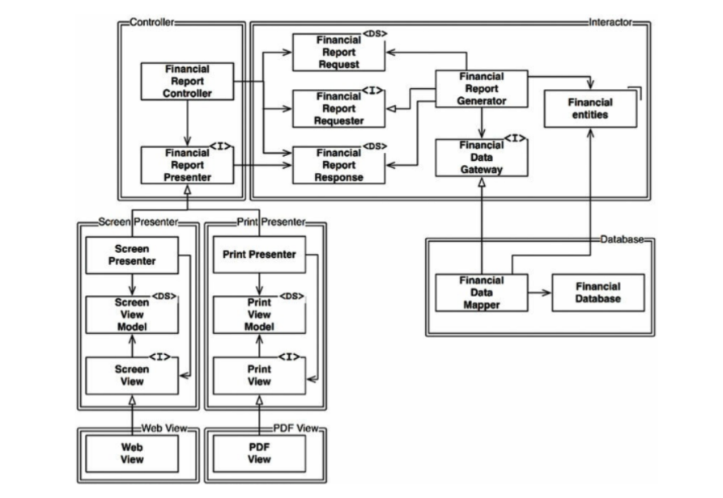
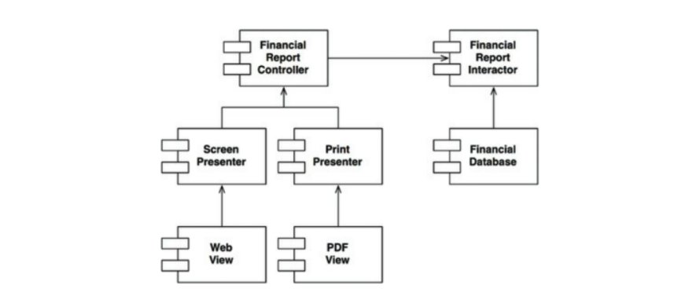

# 8장 OCP : 개방폐쇄 원칙

소프트웨어 개채(`artifact`)는 확장에 열려 있어야 하며, 변경에는 닫혀 있어야 한다.
- 개체의 행위는 확장할 수 있어야 하지만, 이 때 산출물을 변경해서는 안된다.

### 사고 실험
A기능을 이용해 B형태로 보여주는 기능이 있다
이 때, B 형태에 추가적인 사항이 생겨 새로운 C 형태로 보여주는 기능이 추가 되어야 할 때
- 이상적인 코드 변경량 : 0 (변경되는 코드의 양을 최소화해야한다.)

  위 그림에서 FinancialDataMapper은 구현관계를 통해, FinancialDataGateway를 알고 있지만,
  FinancialDataGateway는 FinancialDataMapper를 알지 못한다.
- `<I>` : 인터페이스
- `<DS>` : 데이터 구조
- `->` : 호출 관계
- `-ᐅ ` : 구현 / 상속 관계

-위 그림에서의 화살표는 변경으로부터 보호하려는 컴포넌트를 향하도록 그려진다. (단방향)
- Presenter에서 발생한 변경으로 부터 Controller을 보호하고자한다.
- View에서 발생한 변경으로 부터 Presenter을 보호하고자한다.
- Interactor는 모든 것에서 발생한 변경으로부터 보호하고자 한다.
- Interactor는 어떠한 변경에도 영향 받지 않는다. 가장 높은 수준의 정책을 포함한다.

### 아키텍처를 훌륭하게 만드는 방법
핵심은 SRP 와 DIP에 있다.
- 서로 다른 목적으로 변경되는 요소를 적절히 분리(SRP), 이 요소들 사이의 의존성을 체계화(DIP)를 통해 변경량을 최소화한다.
- 기능이 how, why, when 에 따라서 기능을 분리하고, 분리한 기능을 컴포넌트 계층구조로 조직화한다.
- 컴포넌트 계층구조를 이와 같이 조직화하면 저수준 컴포넌트에서 발생한 변경으로붑터 고수준 컴포넌트를 보호할 수 있다.

### 방향성 제어
- 컴포넌트간 의존성의 방향을 확실히 할 것
- 의존성을 역전시켜 고수준 컴포넌트를 보호할 것

### 정보 은닉
**추이 종속성**
- 클래스 A가 Class B에 의존하고 B가 다시 Class C에 의존한다면, A는 C에 의존하게 된다.
- 추이 종속성을 가지게 되면, 소프트웨어 엔티티는 '자신이 직접 사용하지 않는 요소'에는 절대로 의존해서는 안된다.'는 원칙을 위반하게 된다.
    - ISP, CRP(공통 재사용 원칙)과 관련

### 결론
OCP의 목표
- 시스템을 확장하기 쉬운 동시에 변경으로 인해 시스템에 너무 많은 영향을 받지 않도록 한다.
- 그러기 위해 시스템을 컴포넌트 단위로 분리하고, 저수준 컴포넌트에서 발생한 변경으로부터 고수준 컴포넌트를 보호할 수 있는 형태의 의존성 계층 구조를 이뤄야함 