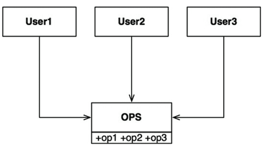
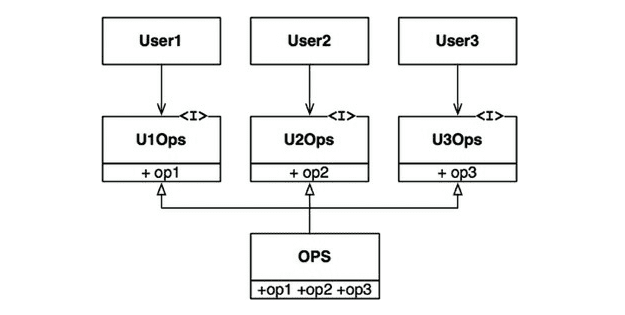

# 10장 ISP : 인터페이스 분리 원칙

각각의 유저 클래스가 숫자에 대응되는 단 하나의 `op?` 메서드를 사용한다고 가정하면
- `User1`의 소스 코드는 op2, op3을 사용하지 않음에도 의존적
- `OPS` 클래스에서는 op2의 소스 코드가 변경되면 `User1`도 컴파일 후 배포해야한다.

이러한 문제는 다음과 같이 오퍼레이션을 인터페이스 단위로 분리하여 해결 가능

### ISP와 언어
- 언어 타입(정적 동적)에 따라 소스 코드 의존성 여부가 다르다.
- 따라서 ISP를 아키텍처가 아니라, 언어와 관련된 문제라고 결론내릴 가능성이 존재한다.

### ISP와 아키텍처
- 필요 이상으로 많은 걸 포함하는 모듈에 의존하는 것은 해로운 일
- 불필요한 재컴파일과 재배포를 강제하기 때문

### 결론
불필요한 짐을 실은 무언가에 의존하면 예상치 못한 문제에 빠질 수 있다 
